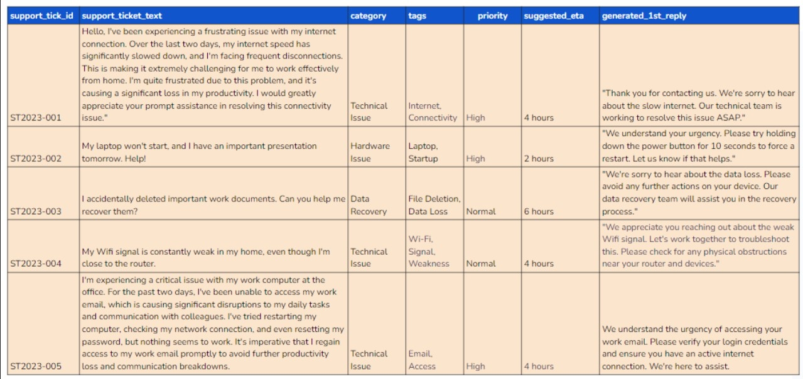

# Support Ticket Categorization using Generative AI-NLP

This repository contains the project **"Support Ticket Categorization using Generative AI-NLP"**, which leverages advanced Natural Language Processing (NLP) techniques and the LLaMA (Large Language Model) to automate the classification and processing of support tickets. The project aims to streamline customer support operations by categorizing tickets, assigning priorities, suggesting resolution times, and generating sentiment-based responses.

---

## Project Description

The **Support Ticket Categorization** project is designed to automate the handling of customer support tickets. By utilizing a generative AI model, the system can:
- Classify support tickets into predefined categories.
- Assign priority levels based on the urgency of the issue.
- Suggest estimated resolution times (ETA).
- Generate professional and sentiment-aligned first responses to customer queries.

This project demonstrates the potential of AI in improving customer support efficiency and reducing manual workload.

---

## Preview
### Support Ticket Categorization Output SnapShot:

---

## Features

- **Automated Ticket Categorization**: Classifies tickets into categories such as "Technical Issue," "Hardware Issue," and "Data Recovery."
- **Priority Assignment**: Automatically assigns priority levels (e.g., High, Normal) based on ticket content.
- **ETA Suggestions**: Provides estimated resolution times for each ticket.
- **Sentiment-Based Responses**: Generates polite and professional first responses tailored to the sentiment of the ticket.
- **JSON Output**: Ensures consistent and structured output for easy integration with ticket management systems.

---

## Prerequisites
- Python 3.8 or higher
- GPU-enabled environment (optional for faster processing)
- Required Python libraries: `pandas`, `llama-cpp-python`, `huggingface_hub`

---

## Usage

1. **Load the Dataset**:
   - Place your support ticket data in a CSV file (e.g., `Support_ticket_text_data.csv`).
   - Ensure the file contains columns like `support_tick_id` and `support_ticket_text`.

2. **Run the Notebook**:
   - Open the `Gen_AI_NLP_Project_Support_Ticket_Categorization_Ajeet.ipynb` file in Jupyter Notebook or Google Colab.
   - Follow the steps in the notebook to process the data and generate outputs.

3. **Output**:
   - The processed data, including ticket categories, priorities, ETAs, and responses, will be saved in a structured format (e.g., CSV).

---

## Acknowledgments

- **Hugging Face** for providing access to pre-trained LLaMA models.
- **Google Colab** for enabling GPU-based execution.
- The open-source community for their contributions to NLP and AI research.

---

Feel free to explore, use, and contribute to this project to enhance customer support automation! 🚀
